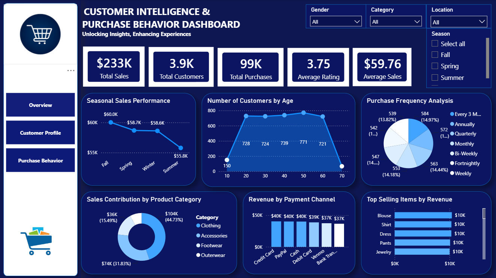
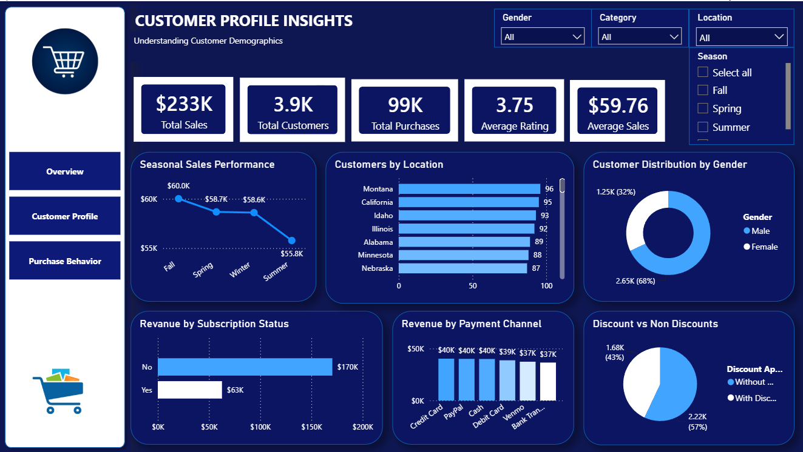
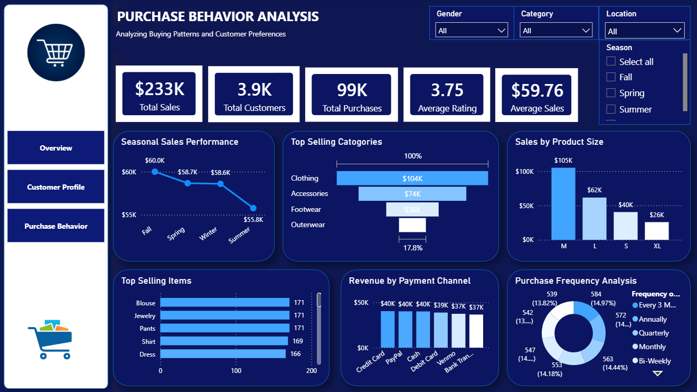

# Customer Intelligence & Purchase Behavior Dashboard

An interactive Power BI dashboard designed to analyze retail sales, understand customer demographics, and uncover purchasing patterns to drive data-backed business decisions.

## 🚀 Live Demo / Dashboard Preview

### 1. Overview Dashboard

### 2. Customer Profile Insights

### 3. Purchase Behavior Analysis

---

## 📊 Key Insights & Metrics (KPIs)
The dashboard tracks vital business metrics from a dataset of over **3,900+ unique customers** and **99K total purchases**:
* **Total Revenue:** $233K with an **Average Sales Value** of $59.76.
* **Customer Satisfaction:** Consistent high ratings averaging **3.75 / 5**.
* **Top Revenue Generator:** *Clothing* dominates sales with **$104K (44.73%)**, followed closely by *Accessories* ($74K).
* **Demographics:** Highly driven by **Male customers (68%)** compared to Female customers (32%).
* **Top Selling Item:** *Blouse, Shirts, and Dresses* lead the inventory sales.

---

## 🛠️ Data Cleaning & Engineering (ETL Process)
Before building the visualizations, the raw dataset underwent a rigorous data cleaning and transformation process using **Power Query Editor**:
* **Data Cleansing:** Identified and removed duplicate values to maintain data integrity.
* **Filtering & Quality Checks:** Filtered out null values and handled anomalies across key columns (Age, Location, Revenue).
* **Data Structuring:** Adjusted data types (e.g., Currency for Sales, Whole numbers for Counts) to optimize model performance.

---

## 📈 Dashboard Features & Visualizations
The project is split into three main focus views with intuitive navigation:

### 1. Overview Page (`Overview.png`)
* **KPI Cards:** Displays Total Sales, Customers, Purchases, Ratings, and Average Sales.
* **Donut Chart:** Sales breakdown by Product Category.
* **Line Chart:** Seasonal sales performance revealing peak trends in *Fall* ($60K).
* **Bar Charts:** Top selling items by revenue and channel breakdown.

### 2. Customer Profile View (`Customer Profile.png`)
* **Demographic Breakdown:** A Donut chart highlighting the 68% Male vs 32% Female user base distribution.
* **Geographical Insights:** Horizontal bar chart tracking customer locations (leading with Montana, California, and Idaho).
* **Subscription Impact:** Tracks revenue generation based on subscription status (Non-subscribers contribute a massive $170K).

### 3. Purchase Behavior Analysis (`Purchase Behavior.png`)
* **Size Analysis:** Visualizes sales performance across different product sizes (Medium `M` being the top performer at $105K).
* **Purchase Frequency:** Pie/Donut breakdown tracking how often customers shop (Annually, Weekly, Monthly, etc.).
* **Payment Channels:** Identifies *Credit Card* and *PayPal* as the top preferred payment methods.

---

## 🧰 Tech Stack Used
* **Data Cleaning & Transformation:** Power Query (Power BI)
* **Data Visualization & Analytics:** Power BI Desktop
* **Design & Layout:** Custom UI Navigation Sidebar
